# Arduino-FFB-wheel
A stand-alone DirectInput USB device is recognized in Windows as a joystick with force feedback functionality, based on BRWheel by Fernando Igor in 2017.

Firmware features:
- supported Arduino boards: Leonardo, Micro, and ProMicro (ATmega32U4, 5V, 16MHz)
- 4 analog axis + 1 for an optical or magnetic encoder, 2 FFB axis (with multichannel PWM or DAC output)
- for 2 FFB axis mode - 2 magnetic encoders may be used (for X and Y axis)
- automatic or manual analog axis calibration
- up to 16 buttons by 4x4 matrix or via **[button box firmware](https://github.com/ranenbg/Arduino-FFB-wheel/tree/master/tx_rw_ferrari_458_wheel_emu_16buttons)** uploaded to Arduino Nano/Uno
- up to 24 buttons by 3x8bit shift register chips
- analog XY H-pattern shifter (configurable to 6 or 8 gears + reverse gear, XY axis invert, reverse gear button invert)
- fully supported 16bit FFB effects (custom force effect not implemented)
- envelope and conditional block effects, start delay, duration, deadband, and direction enable
- FFB calculation and axis/button update rate 500Hz (2ms period)
- many firmware options (external 12bit ADC/DAC, automatic/manual pedal calibration, z-index support/offset/reset, hat switch, button matrix, external shift register, hardware wheel re-center, xy analog H shifter, FFB on analog axis)
- RS232 serial interface for configuring many firmware settings (10ms period)
- fully adjustable FFB output in the form of 4-channel digital 16bit PWM or 2-channel analog 12bit DAC signals
- available PWM modes: PWM+-, PWM+dir, PWM0-50-100, RCM (if 2 FFB axis: 2CH PWM+-, 2CH PWM+dir, 2CH PWM0-50-100, 2CH RCM)
- available DAC modes: DAC+-, DAC+dir, DAC0-50-100 (if 2 FFB axis: 1CH DAC+-, 2CH DAC+dir, 2CH DAC0-50-100)
- load cell support for 24bit HX711 chip (for Y axis only)
- all firmware settings are stored in EEPROM (and automatically loaded at each Arduino powerup)
- original wheel control user interface **[Arduino FFB gui](https://github.com/ranenbg/Arduino-FFB-gui)** for an easy configuration and monitoring of all inputs/outputs 

Detailed documentation and more information about the firmware can be found in txt files inside **[docs](brWheel_my/docs)** folder. All necessary wiring diagrams are in **[wirings](brWheel_my/wirings)** folder.

This fork (`bitwiresys/Arduino-FFB-wheel-v3`) adds motor over-temperature FFB cutoff (NTC thermistor) and per-axis invert/disable, on top of everything below. It does **not** track compiled `.hex` files in git - every push is built and published automatically, see [Firmware download](#firmware-download) below for how to find the right file for your hardware.

# Firmware pinouts and wiring diagrams

## Optical encoder and LED wiring
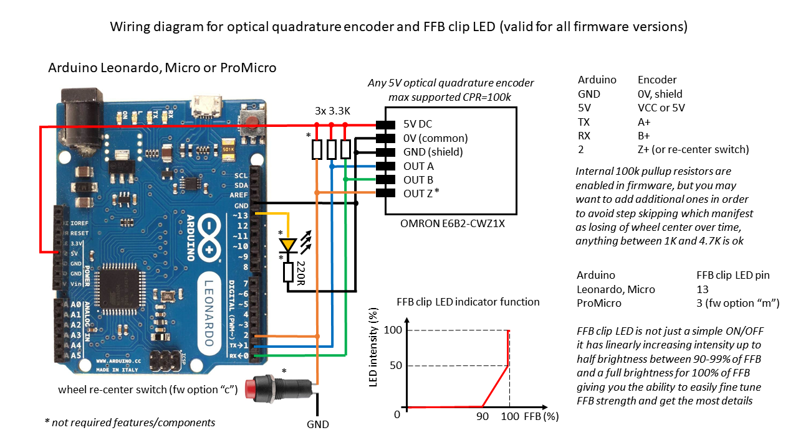
## Magnetic encoder wiring
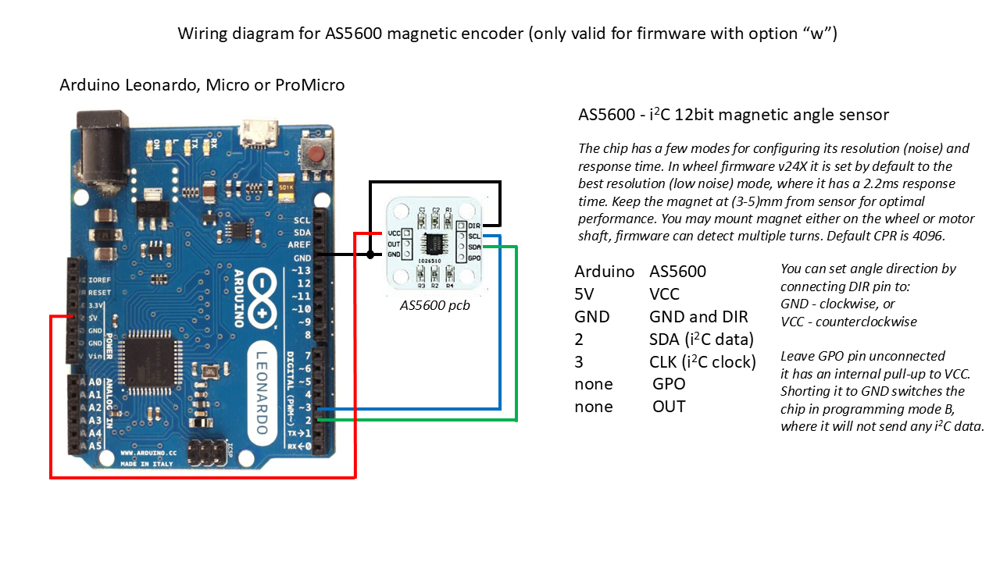
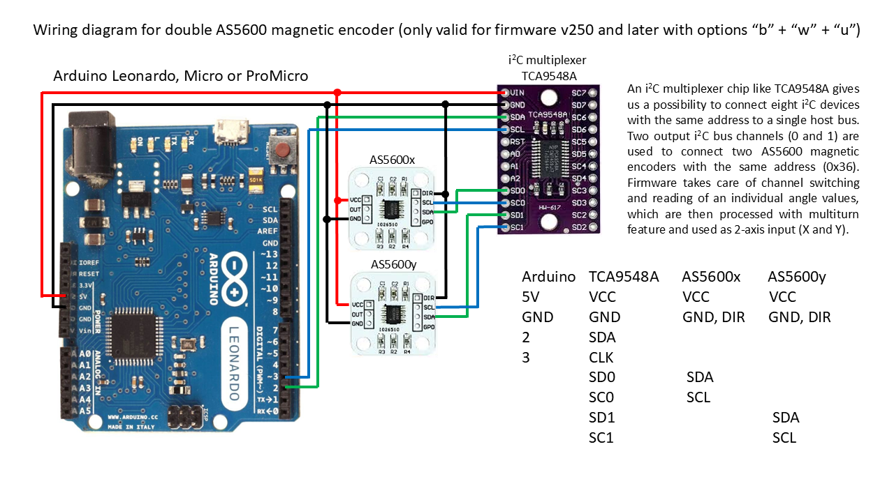
## Motor driver wiring
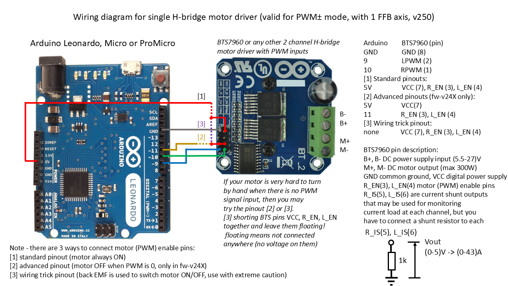
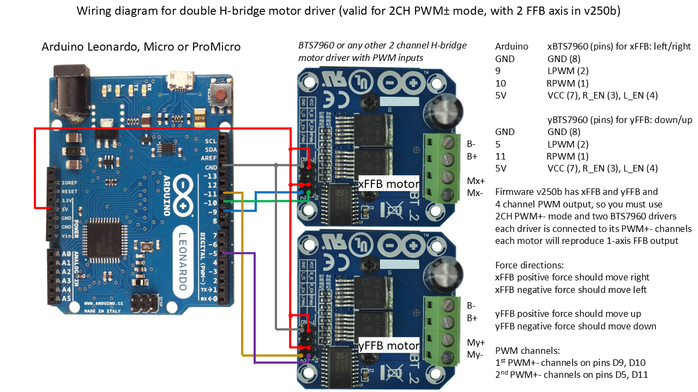
## Button box firmware pinouts - for Arduino Nano/Uno

## Button box firmware pinouts - for shift register chips
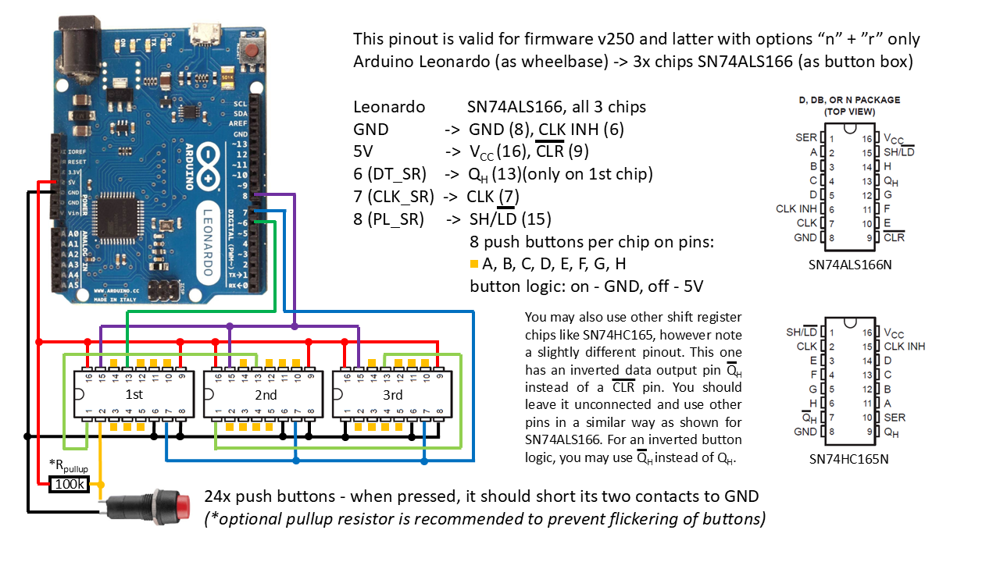
## Button matrix pinouts
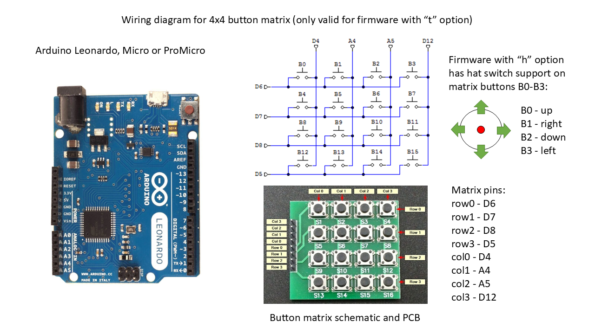
## External i2C device pinouts
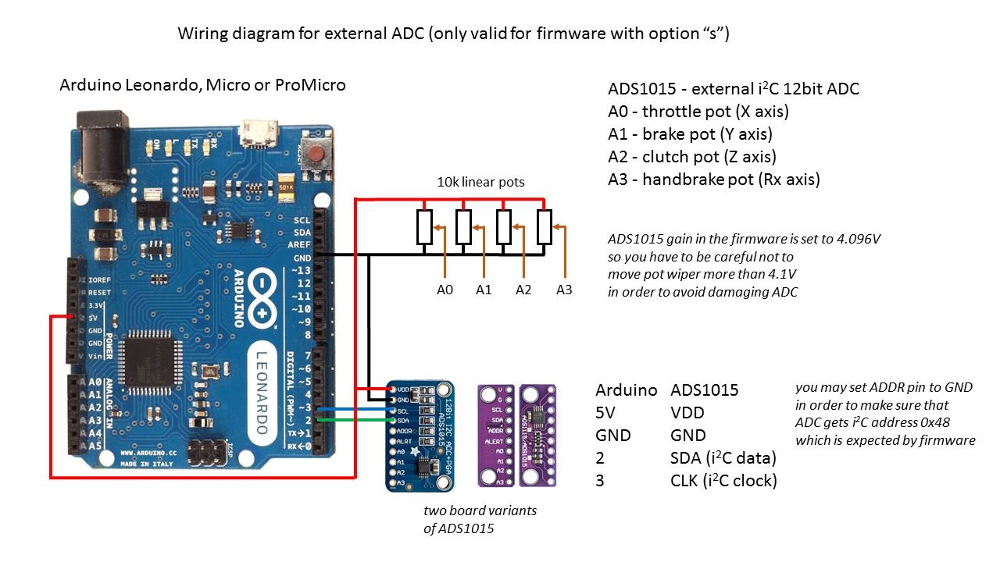
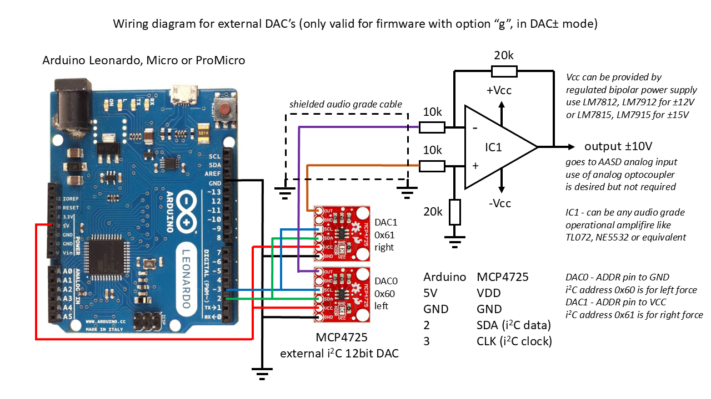
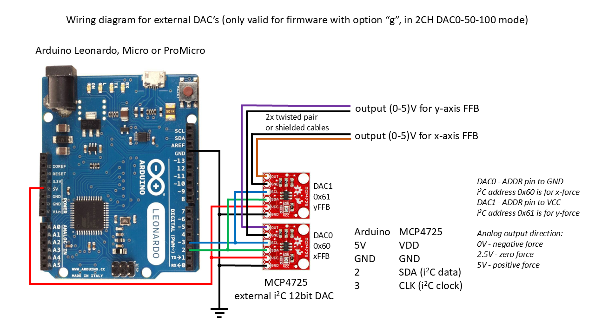
## HX711 and load cell wiring
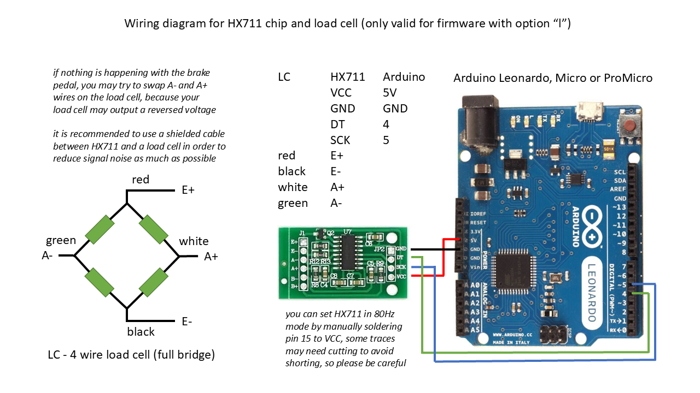
## XY shifter wiring
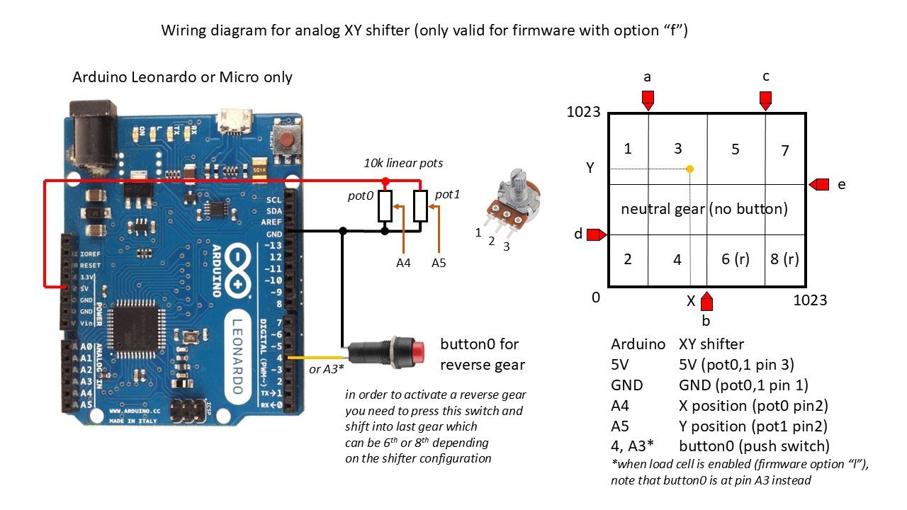

## Firmware option description
Due to the 32k flash memory limitation in Arduino Leonardo (ATmega32U4), each HEX file is compiled with a certain firmware option. A one-letter abbreviation for each option is placed in the firmware version string and one needs to consider carefully which one to choose. In the release, I've compiled a few of the most often-used firmware option combinations for you.

Firmware versions (old), I have put some logic in firmware naming, so here is some basic explanation (if you plan to upgrade old firmware until fw-v24X please respect this):
-  	 fw-vXX,  two digits only are test versions of new firmware features (not used anymore)
-  	 fw-vXX0, three digits ending with 0 - the basic firmware with no external devices support, except for optical/magnetic encoder (has PWM signal as FFB output)
-  	 fw-vXX1, three digits ending with 1 - adds support for the external button box
-  	 fw-vXX2, three digits ending with 2 - adds support for both external button box and load cell
-  	 fw-vXX3, three digits ending with 3 - adds support for external button box, load cell, and two external 12bit DAC - MCP4725 (has analog signal as FFB output)

Firmware versions (new) from fw-v250, I've changed firmware naming logic such that all 3 digits in the name now represent firmware version only (letters are options, see below)
- a - pedal autocalibration enabled (if no a, then manual calibration is enabled)
- b - 2 FFB axis support with physical output (4-channel digital PWM or 2-channel analog DAC outputs available)
-	w - magnetic encoder AS5600 support
- d - no optical encoder support
- z - support 3rd channel or z-index on optical encoders
- h - enabled Hat Switch (uses first 4 buttons)
- s - enabled external 12bit ADC for analog inputs (ADS1015 i2C)
- t - enabled 4x4 button matrix
- f - enabled XY analog H-pattern shifter
- i - enabled averaging of analog inputs (with 4 samples - 12bit resolution)
-	e - support for two additional digital buttons (on pins A2, A3 - clutch and handbrake axis will be unavailable)
-	x - enables the option to select to which (analog) axis FFB is tied to
- r - support for external shift register chips for 24 buttons (3x SN74ALS166 wired in series)
- n - support for external button box for 16 buttons via Arduino Nano (with my button box firmware)
- l - support for HX711 chip and load cell (on the y-axis)
- g - support for external 12bit DAC to be used for analog FFB output (2x MCP4725 i2C)
-	p - no EEPROM support for loading/saving firmware settings (firmware defaults are loaded at each startup)
-	u - support for 2 magnetic encoders (AS5600) via i2C multiplexer chip (TCA9548A)
- m - replacement pinouts for ProMicro (for FFB clipping LED, buttons 3 and 4, PWM direction pin)
- o - motor NTC 100k thermistor over-temperature FFB cutoff (this fork only, opt-in)
- v - per-axis invert/disable via RS232 commands (this fork only, opt-in)

Note* Some combinations are not possible at the same time, while some are not possible due to ATmega32U4 32k memory limit.
      If you decide to compile the source code yourself, enabling these options is just a matter of commenting/uncommenting their corresponding lines at the beginning of Config.h

## Firmware download - find the right build for your hardware

1. Decide your board: **Leonardo/Micro** (stock pinout) or **ProMicro** (replacement pinout, `m` option).
2. Decide which options you need from the list above (e.g. `w` for AS5600 magnetic encoder, `o` for the NTC over-temp cutoff, `v` for axis invert/disable).
3. Open the **[Latest Release](https://github.com/bitwiresys/Arduino-FFB-wheel-v3/releases/latest)** and download the build zip. It contains:
   - `leonardo/` and `promicro/` folders with every supported `.hex` combination (named `..._v250<letters>.hex`, e.g. `brWheel_my.ino.leonardo_v250dwov.hex` = AS5600 + NTC cutoff + axis tweaks)
   - `manifest.json` - a machine-readable list of every file with its board and a plain-English description of each enabled feature, so you can match your exact hardware without guessing what a letter combo means
4. The exact set of letter-combos built for each board is declared in **[.github/variants/leonardo.txt](.github/variants/leonardo.txt)** and **[.github/variants/promicro.txt](.github/variants/promicro.txt)** - if the combination you need isn't listed (usually because it doesn't fit in the ATmega32U4's 32KB flash), you'll need to compile it yourself (see below) or drop an option.
5. Past builds: **[all releases](https://github.com/bitwiresys/Arduino-FFB-wheel-v3/releases)**.

## Motor NTC thermistor wiring (option `o`)

For the motor over-temperature FFB cutoff feature, wire a 100K NTC thermistor as a voltage divider into pin **A4**:

```
5V --- [fixed resistor] ---+--- [NTC 100K] --- GND
                            |
                            A4
```

The fixed resistor value and thermistor curve (Beta) are hard-coded in `Config.h` (no in-firmware calibration) - if you use different hardware than a 100K NTC with a 330Ω fixed resistor, adjust `NTC_R_FIXED`/`NTC_BETA` in `Config.h` before compiling. The over-temperature threshold (80-200°C, default 120°C) is adjustable live from the control panel, no reflash needed.

## Firmware upload procedure
You can use **[XLoader](XLoader)**:
- set 57600baud, ATmega32U4 microcontroller and select desired HEX
- press the reset button on Arduino (or shortly connect the RST pin to GND)
- select the newly appeared COM port (Arduino in bootloader mode*) and press upload, you will only have a few seconds

*It is possible that some cheap Chinese clones of Arduino Leonardo, Micro, or ProMicro do not have a bootloader programmed. In that case you need to upload the original Arduino Leonardo bootloader first. You can find more details about it here: https://docs.arduino.cc/built-in-examples/arduino-isp/ArduinoISP

## How to compile the source
In order to compile the firmware yourself you may use Windows, 8, 10 or 11, you need to install Arduino IDE v1.8.19 and Arduino Boards v1.6.21. You must place all **[libraries](arduino-1.8.5/libraries)** in your .../documents/Arduino/Libraries folder. In Windows folder options set to show hidden files and folders then navigate to C:\Users\yourusername\AppData\Local\Arduino15\packages\arduino\hardware\avr\1.6.21\cores. Rename the folder "arduino" as a backup as we will need some files from it later, I just add "arduino_org" to the filename. Create a new folder called "arduino" and place the entire content from  **[modified core](arduino-1.8.5/hardware/arduino/cores/arduino)** into newly created "arduino" folder. Navigate back to "arduino_org" folder and copy files "IPAddress.cpp", "IPAddress.h", "new.cpp" and "new.h", then paste and replace the ones inside the "arduino" folder. That should fix all errors and you should be able to compile the code. Bare in mind that if you make any changes to HID or USB core files you will need to repeat the procedure and paste all modified files into the newly created "arduino" folder each time.

To build every supported variant the same way CI does, see **[.github/scripts/build_hex.py](.github/scripts/build_hex.py)** - it reads the letter-combo lists from `.github/variants/leonardo.txt` and `.github/variants/promicro.txt` and produces a `dist/` folder with all `.hex` files plus `manifest.json`.

## Troubleshooting X-axis stuck at -540deg
If you used some of the earlier firmware versions before fw-v22X, windows remembered the axis raw HID calibration which was +-32k. This issue occurs when you upload the latest firmware with new X-axis calibration 0-65k, which is incompatible with the previous HID calibration that Windows remembered for this FFB joystick device. However, there is a very easy fix for it, all we need to do is reset the device calibration in Windows. This can be done by using the program **[DXtweak2](FFB_misc_programs)**. Open the program and select Arduino Leonardo as a device if you have more than one FFB-capable device. Click on the device defaults button, then click the apply button and close the program. That's all.

## Credits

- FFB HID and USB core for Arduino by: Peter Barrett
- BRWheel firmware by: Tero Loimuneva, Saku Kekkonen, Etienne Saint-Paul, and Fernando Igor
https://github.com/fernandoigor/BRWheel/tree/alphatest
